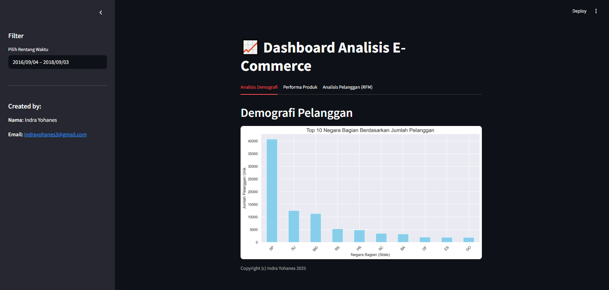
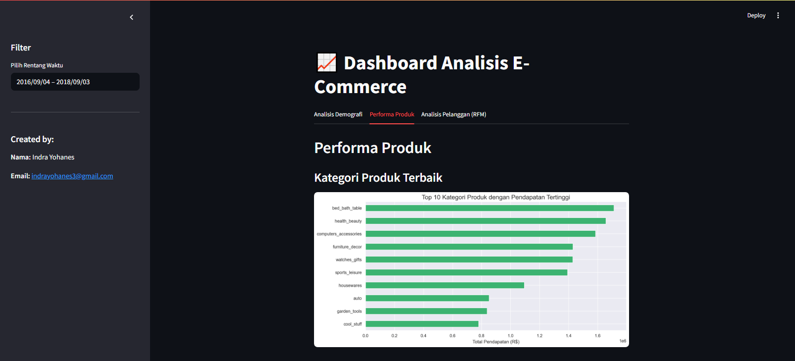
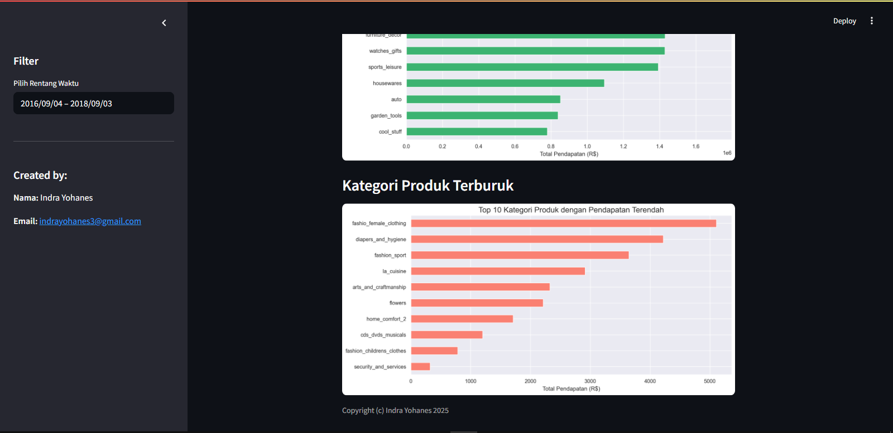
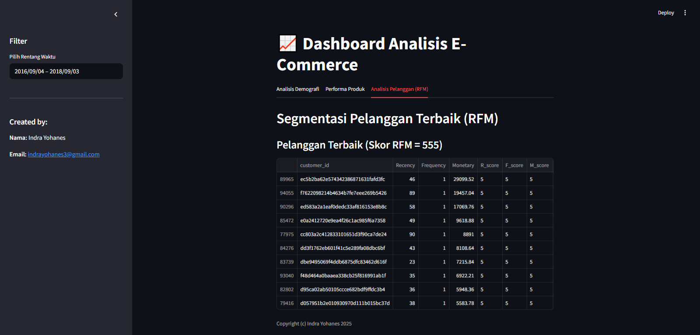

E-commerce Data Analysis Dashboard
This project is an interactive dashboard built with Streamlit for a comprehensive analysis of E-commerce data. It allows users to gain insights into customer behavior, product performance, and overall sales trends.

🛠️ Built With
Python

Streamlit - The core framework for building the interactive web app.

Pandas - For data manipulation and analysis.

Plotly / Matplotlib / Seaborn - For data visualization.

✨ Features
This dashboard provides three main analytical views:

Customer Demographic Analysis: Visualize the distribution of customers based on geographic locations and other demographic factors.
Product Performance Analysis: Identify the best and worst-selling products to optimize inventory and marketing strategies.
RFM Customer Segmentation: Segment customers using the RFM (Recency, Frequency, Monetary) model to understand and target different customer groups effectively.
📸 Dashboard Preview
Here are some snapshots of the dashboard in action.

Customer Demographics Analysis

Best & Worst Performing Products

RFM Segmentation Analysis

🚀 Getting Started
Follow these instructions to get a copy of the project up and running on your local machine for development and testing purposes.

Prerequisites
Make sure you have Python 3.8 or newer installed on your system.

Installation & How to Run
Create a virtual environment 

# For macOS/Linux
python3 -m venv venv
source venv/bin/activate

# For Windows
python -m venv venv
.\venv\Scripts\activate
Install the required libraries by running the following command in your terminal:

pip install -r requirements.txt
Run the Streamlit application with the command:

streamlit run dashboard.py
Open your web browser and navigate to the following local URL:
http://localhost:8501
